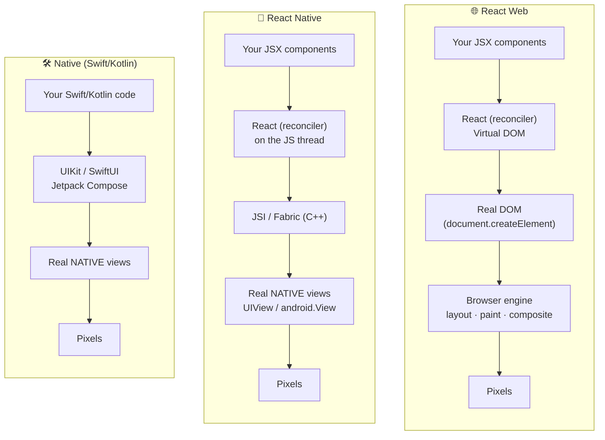
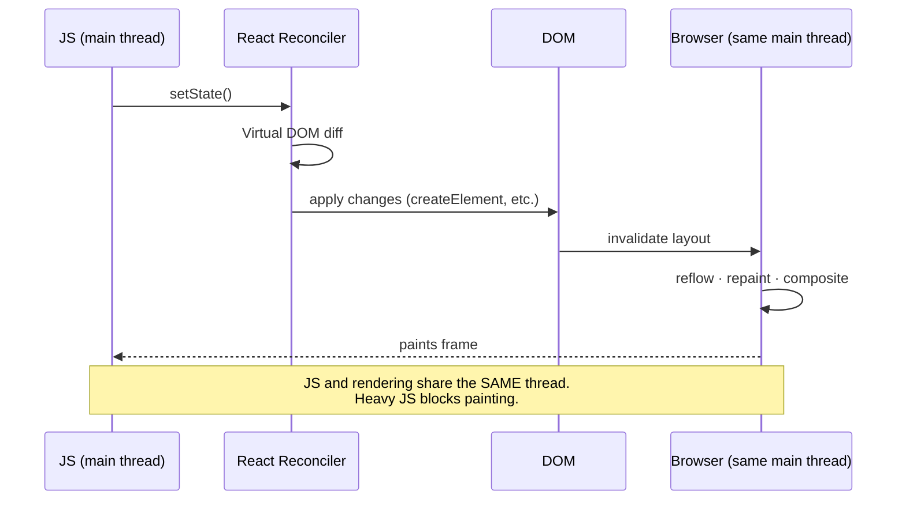
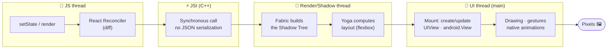
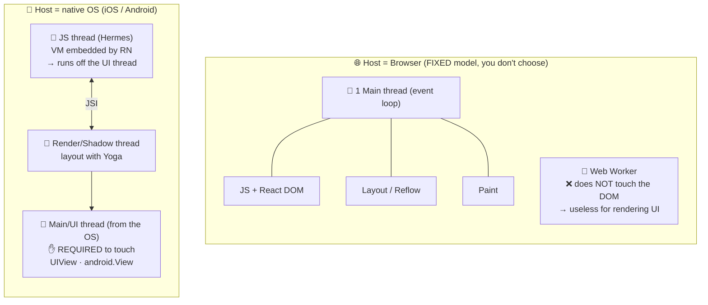
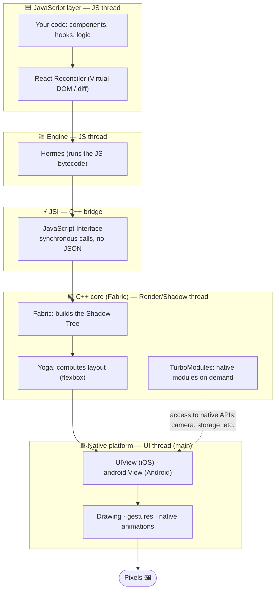
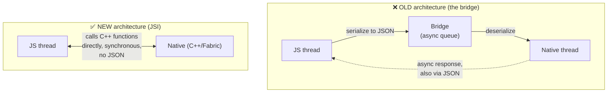
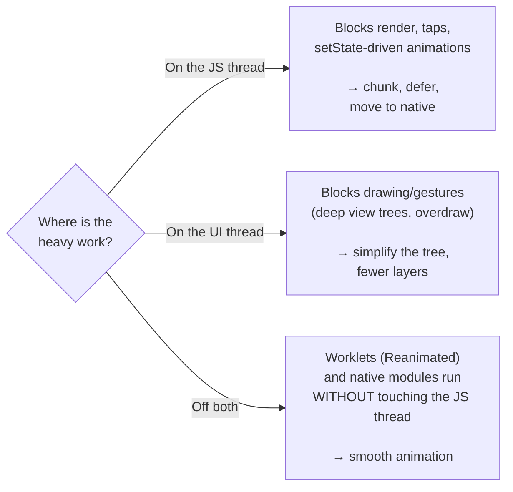
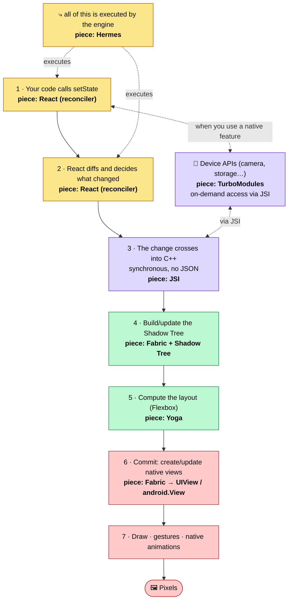

# How React Native works — compared with React Web and Native

A companion document for the study. The goal is to answer: **"what happens between your `<View>` and the pixel on screen?"** — and why that matters for performance.

> The diagrams below use Mermaid (they render directly in VS Code and on GitHub).

---

## 1. Overview: three ways to draw on screen



**The essential difference:**
- **React Web** produces **DOM** (HTML elements) that the browser draws.
- **React Native** produces **real native views** (`UIView` on iOS, `android.View` on Android) — not a WebView, not HTML. RN's `<View>`/`<Text>` become native components.
- **Native** you create the views yourself, with no JS layer in between.

> In other words: RN uses the **same React "brain"** (the reconciler/Virtual DOM) as React Web, but swaps the **rendering target** from DOM to native views. This is React's pluggable *renderer* concept (React DOM vs React Native).

---

## 2. React Web: everything on the browser's main thread



In the browser, JavaScript and rendering (layout/paint) share the **main thread**. That's why, on the web, a huge `for` loop also freezes the UI — the same problem as our Demo 1, just without the thread separation.

---

## 3. React Native (New Architecture): the thread separation

This is the part that matters most for the study. The path from a `setState` to the pixel crosses **different threads**:



**Mapping to our demos:**

| Step | Thread | Demo that stresses this step |
| --- | --- | --- |
| Render / reconciliation | JS thread | **Demo 2** (unnecessary re-renders) |
| Synchronous work in your code | JS thread | **Demo 1** (loop blocking the JS thread) |
| Layout (Yoga) + building the tree | Render thread | **Demo 3** (mounting 3000 items at once) |
| Drawing + animation on screen | UI thread | **Demo 4** (UI-thread animation stays smooth) |

---

## 4. Why does React Native have MORE threads than React Web?

The answer is counterintuitive: **the number of threads is not a React decision — it's imposed by the platform (the _host_) it runs on.** React itself (the reconciler/Virtual DOM) is single-threaded in both cases. What changes is the surrounding environment.

### 4.1. The cause: the host is different



Two constraints of the native world **force** the separation:

1. **The OS requires all UI to run on the main/UI thread.** On iOS and Android, touching `UIView`/`android.View` is only allowed on the main thread. That thread already exists and belongs to the system.
2. **JavaScript doesn't run natively on mobile** — RN must *embed* an engine (Hermes). That VM naturally runs on its own thread, **separate** from the OS UI thread.

Simply by existing in this environment, RN **is born with two threads** (JS + UI). From there came the design decision: since they're already separate, RN also put **layout (Yoga) on its own render/shadow thread**, so it blocks neither the JS nor the UI.

In the browser it's the opposite: **JS and rendering share the same main thread** and you can't change that. There's a `Web Worker`, but it **can't touch the DOM**, so it can't render UI. That's why React DOM is forced to live on a single thread.

### 4.2. The React Native architecture in layers



**Reading top to bottom:** your React code runs on Hermes (JS thread) → crosses the JSI → Fabric builds the tree and Yoga computes layout (render thread) → native views are created/updated and drawn (UI thread). **TurboModules** are the side path to the device's native APIs.

### 4.3. In one sentence

```
Web:  1 single-threaded platform for UI  →  React DOM fits in 1 thread (no choice)
RN :  native UI FORCES the main thread  +  JS needs an embedded VM (another thread)
      →  already 2, and RN adds the layout one to decouple  →  3
```

On the web, the separation would be **impossible** (the browser won't allow it). On React Native it's **inevitable** (the OS forces it) **and desirable** (keeps the UI smooth even when JS is frozen) — the foundation of the whole performance study.

---

## 5. Why the New Architecture is faster: old bridge vs JSI



- **Old bridge:** all JS↔native communication was **asynchronous** and required **serializing everything to JSON**. With big lists or many events (scroll, gestures), that queue became the bottleneck — hence "avoid the bridge".
- **JSI (new):** JS holds **direct references** to C++/native objects and calls them **synchronously, without serialization**. The bridge is no longer the bottleneck. That's why much of the old advice changed.

---

## 6. Comparison table

| Aspect | React Web | React Native (New Arch) | Native (Swift/Kotlin) |
| --- | --- | --- | --- |
| What is rendered | DOM (HTML) | Real native views | Real native views |
| The "brain" (reconciler) | React DOM | React Native (Fabric) | — (you write it directly) |
| Where JS runs | Browser's main thread | Separate JS thread (Hermes) | No JS |
| UI threads | 1 (main) | JS + Render + UI (separate) | Native UI thread |
| Smooth animations under load | Hard (same thread) | Yes, via UI thread (Reanimated) | Yes, native |
| Typical cause of jank | Heavy JS on the main thread | Blocked JS thread / re-renders | Heavy work on the main thread |
| JS↔UI bridge | N/A (same runtime) | JSI (synchronous, no JSON) | N/A |

---

## 7. The big takeaway for performance



React Native's thread separation is a **double-edged sword**:
- **Upside:** you can keep animations/gestures smooth on the UI thread even when JS is busy (impossible on plain web).
- **Cost:** cross-thread communication has a price, and it's easy to overload the JS thread without noticing.

**Profiling is precisely figuring out which of these three boxes your problem is in** — and this project's 4 demos exist so you can see each one in isolation.

---

## 8. Architecture glossary — Hermes, JSI, Fabric, Yoga…

The guiding idea: to draw on screen you need 4 things — **(1)** run the JS, **(2)** decide what changed, **(3)** compute where everything goes, **(4)** draw it. On the web the **browser** gives you almost all of it for free. On RN there's **no browser**, so React Native had to bring each piece on its own — that's why they have names.

Each piece below follows the template: **what it is → React Web equivalent → Native equivalent → why it exists.**

### 🟨 Hermes — the JavaScript engine
- **What it is:** the engine that actually executes your JS on the device. It compiles JS to **bytecode ahead of time** (at build time) and runs **without JIT**, optimized to start fast and use little memory.
- **In React Web:** the browser's engine — **V8** (Chrome), **JavaScriptCore** (Safari), **SpiderMonkey** (Firefox). It comes embedded in the browser.
- **In Native:** **doesn't exist.** Swift/Kotlin compile straight to machine code; there's no JS.
- **Why it exists:** a phone has no browser to borrow the engine from, so RN must *embed* one. Hermes was built by Meta for the mobile case: **fast startup** (bytecode ready), **low memory**, small size.

### ⚡ JSI — JavaScript Interface
- **What it is:** a thin **C++** layer that lets JS **hold references to and call native objects/functions directly, synchronously and without serializing**. It replaced the old "bridge" (async JSON). It's engine-agnostic.
- **In React Web:** the engine's **internal bindings** — V8 exposes the DOM (C++) to JS as _host objects_. Always existed, but it's internal and invisible.
- **In Native:** **doesn't apply** — the code is already native, there's no boundary to cross.
- **Why it exists:** JS↔native communication was the biggest bottleneck of the old architecture. JSI gives JS the power the browser always had: talking to C++/native **directly, instantly, without translating to text**.

### 🟩 Fabric — the renderer
- **What it is:** RN's rendering system, rewritten in **C++**. It turns the React tree into **native views**, managing the Shadow Tree and the _commit_ to the screen.
- **In React Web:** **React DOM** — the renderer that turns `<div>` into DOM nodes. Fabric is "the React DOM of the native world".
- **In Native:** **you yourself** writing UIKit/SwiftUI or the View system/Jetpack Compose.
- **Why it exists:** the old renderer (*Paper*) was JS-driven, asynchronous, with no synchronous layout measurement and no support for concurrent React. Fabric (C++, shared across platforms) enables **synchronous measurement**, **concurrent rendering**, and better UI-thread integration.

### 🌳 Shadow Tree — the intermediate tree
- **What it is:** an **immutable tree of _shadow nodes_** (C++, on the render thread) that mirrors your React tree and holds the already-computed layout. It sits between "your components" and "the real native views".
- **In React Web:** the **render/layout tree** the browser builds from the DOM + CSSOM.
- **In Native:** no explicit equivalent — the view hierarchy *is* the tree.
- **Why it exists:** it lets layout be **computed off the main thread** and lets two versions be **diffed** before touching native views (which are expensive to create/change).

### 📐 Yoga — the layout engine
- **What it is:** a **C++** library that implements **Flexbox**. It takes your styles (`flex`, `margin`, `justifyContent`…) and computes each element's position and size.
- **In React Web:** the **browser's layout engine** (Blink/WebKit/Gecko) computing CSS (Flexbox, Grid, etc.). For free.
- **In Native:** **Auto Layout** (iOS) and **ConstraintLayout** (Android) — different from each other and not Flexbox.
- **Why it exists:** RN needs `flexDirection: 'row'` to behave **identically** on iOS, Android, and web. Since no platform uses Flexbox natively, Meta shipped its **own Flexbox engine** for consistent layout everywhere.

### 🔌 TurboModules — access to native APIs
- **What it is:** the new system for **native modules** (camera, storage, GPS, haptics…). Loaded **on demand** (lazy), with **synchronous, typed** access via JSI.
- **In React Web:** the browser's **Web APIs** (`navigator.geolocation`, `fetch`, `localStorage`…) — also bridges to the browser's C++.
- **In Native:** **call the SDK directly** (e.g., `AVFoundation`, `CameraX`).
- **Why it exists:** the old `NativeModules` were loaded **all at startup** and went through the async bridge. TurboModules are **lazy** (faster startup) and **synchronous** via JSI.

### 🧩 Codegen — the typed "contract"
- **What it is:** a tool that **generates the glue code** (C++/Java/ObjC) between JS and native from TypeScript/Flow specs, for TurboModules and Fabric components.
- **In web / native:** no equivalent.
- **Why it exists:** it ensures JS and native agree on types **at build time**, avoiding errors at the JSI boundary.

---

### The full flow: where each piece enters

Putting it all together — the path from a `setState` to the pixel, with **each piece named** at the point where it acts and on which thread:



> 🟨 yellow = **JS thread** (Hermes) · 🟪 purple = **JSI boundary (C++)** · 🟩 green = **Render/Shadow thread** (Fabric + Yoga) · 🟥 red = **UI thread** (native views).

**Step by step, with the responsible piece:**

| # | Step | Piece | Thread |
| --- | --- | --- | --- |
| 1–2 | You change state; React computes the _diff_ | **React reconciler**, running on **Hermes** | JS thread |
| 3 | The change crosses to the native side, sync and without serializing | **JSI** | boundary (C++) |
| 4 | The new node tree is built | **Fabric** + **Shadow Tree** | Render thread |
| 5 | Positions/sizes are computed (Flexbox) | **Yoga** | Render thread |
| 6 | The real native views are created/updated (_commit_) | **Fabric** → `UIView`/`android.View` | UI thread |
| 7 | The screen is drawn; gestures and native animations run | native platform | UI thread |
| — | When a device feature is needed | **TurboModules** (on demand, via **JSI**) | JS ↔ native |
| build | Generates the typed glue between JS and native (not at runtime) | **Codegen** | at build time |

> **Connection to profiling:** each color is a different thread. When the app stutters, the question is *"which color is the bottleneck in?"* — heavy JS (yellow, Demos 1 and 2), layout/mounting lots of things (green, Demo 3), or drawing/animation (red, Demo 4). **Codegen** doesn't appear at runtime because its work happens at build time.

---

### The big takeaway: the browser already did all of this

Each piece of the New Architecture is something the **browser already gave you built-in**, and which RN had to recreate because there's no browser on a phone:

| Function | React Web (free, in the browser) | React Native (its own piece) | Native |
| --- | --- | --- | --- |
| Run JS | V8 / JavaScriptCore | **Hermes** | — (no JS) |
| JS talking to the UI (C++) | engine's internal bindings | **JSI** | — (already native) |
| Turn React into UI | React DOM | **Fabric** | you write UIKit/Compose |
| Intermediate tree | browser's render/layout tree | **Shadow Tree** | the view hierarchy itself |
| Compute layout | browser's CSS engine | **Yoga** (Flexbox) | Auto Layout / ConstraintLayout |
| Access device features | Web APIs (`navigator`, etc.) | **TurboModules** | native SDK directly |
| The "brain" (diff) | React (reconciler) | React (reconciler) — **the same** | — |

> **Conclusion:** React Web "outsources" 90% of the heavy lifting to the browser. React Native, with no browser, had to **reimplement the entire browser in miniature** (Hermes = engine, Yoga = CSS layout, Fabric = renderer, JSI = bindings, TurboModules = Web APIs). Understanding each piece gives you the complete mental model of where performance can break.