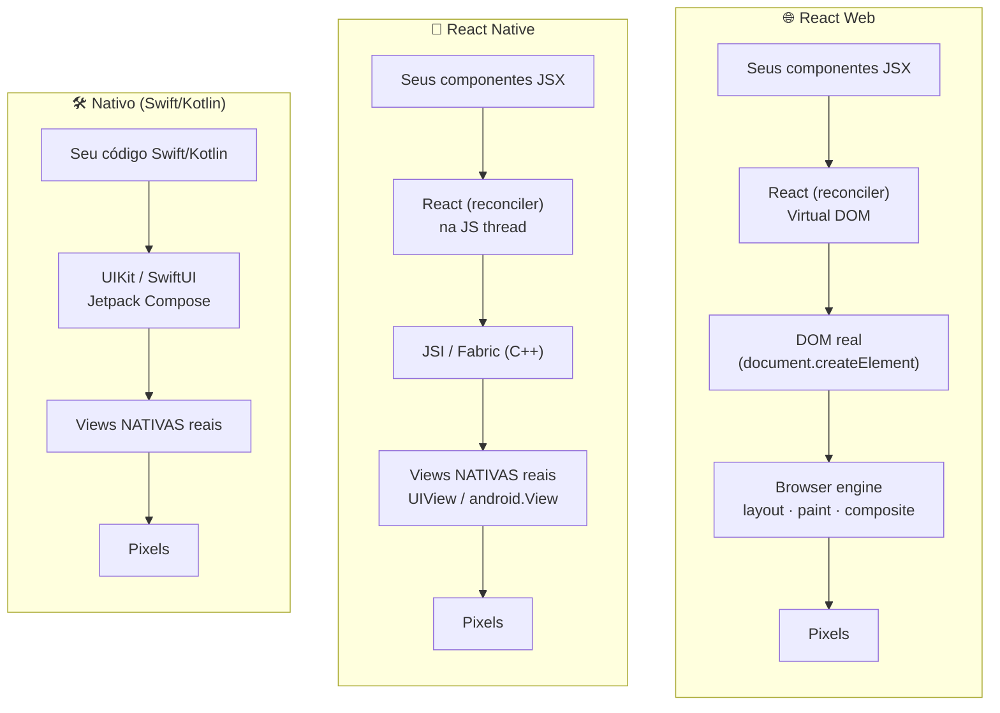
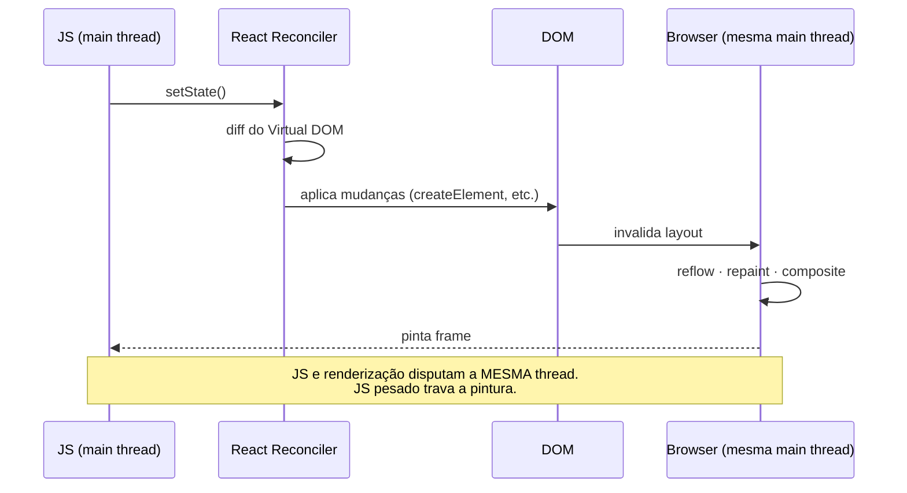
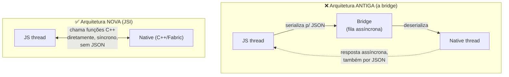
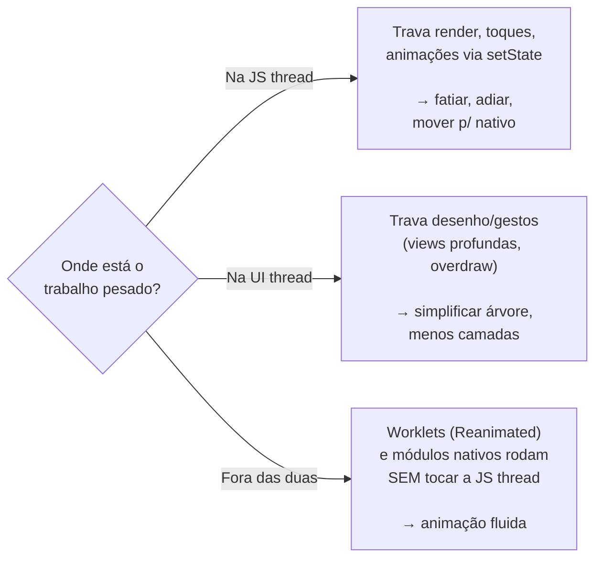

# Como o React Native funciona — comparado com React Web e Nativo

Documento de apoio ao estudo. O objetivo é responder: **"o que acontece entre o seu `<View>` e o pixel na tela?"** — e por que isso importa para performance.

> Os diagramas abaixo usam Mermaid (renderizam direto no VS Code e no GitHub).

---

## 1. Visão geral: três formas de desenhar na tela

**A diferença essencial:**
- **React Web** produz **DOM** (elementos HTML) que o browser desenha.
- **React Native** produz **views nativas de verdade** (`UIView` no iOS, `android.View` no Android) — não é WebView, não é HTML. O `<View>`/`<Text>` do RN viram componentes nativos.
- **Nativo** você mesmo cria as views, sem camada de JS no meio.

> Ou seja: RN usa o **mesmo "cérebro" do React** (o reconciler/Virtual DOM) que o React Web, mas troca o **"alvo de renderização"** de DOM para views nativas. É o conceito de *renderer* plugável do React (React DOM vs React Native).

---

## 2. React Web: tudo na main thread do browser

No browser, JavaScript e a renderização (layout/paint) compartilham a **main thread**. Por isso, no web, um `for` gigante também trava a UI — mesmo problema da nossa Demo 1, só que sem a separação de threads.

---

## 3. React Native (New Architecture): a separação em threads

Esta é a parte que mais importa para o estudo. O caminho de um `setState` até o pixel passa por **threads diferentes**:

**Mapeando para as nossas demos:**

| Etapa | Thread | Demo que estressa essa etapa |
| --- | --- | --- |
| Render / reconciliação | JS thread | **Demo 2** (re-renders desnecessários) |
| Trabalho síncrono no seu código | JS thread | **Demo 1** (loop bloqueando a JS) |
| Layout (Yoga) + montar a árvore | Render thread | **Demo 3** (montar 3000 itens de uma vez) |
| Desenho + animação na tela | UI thread | **Demo 4** (animação na UI thread segue suave) |

---

## 4. Por que a New Architecture é mais rápida: bridge antiga vs JSI

- **Bridge antiga:** toda comunicação JS↔nativo era **assíncrona** e exigia **serializar tudo em JSON**. Em listas grandes ou muitos eventos (scroll, gestos), essa fila virava gargalo — o famoso "evite passar pela bridge".
- **JSI (nova):** o JS guarda **referências diretas** a objetos C++/nativos e os chama **sincronamente, sem serialização**. A bridge deixou de ser o gargalo. Por isso muitos conselhos antigos mudaram.

---

## 5. Tabela comparativa

| Aspecto | React Web | React Native (New Arch) | Nativo (Swift/Kotlin) |
| --- | --- | --- | --- |
| O que é renderizado | DOM (HTML) | Views nativas reais | Views nativas reais |
| "Cérebro" (reconciler) | React DOM | React Native (Fabric) | — (você escreve direto) |
| Onde o JS roda | Main thread do browser | JS thread separada (Hermes) | Não há JS |
| Threads de UI | 1 (main) | JS + Render + UI (separadas) | UI thread nativa |
| Animações suaves sob carga | Difícil (mesma thread) | Sim, via UI thread (Reanimated) | Sim, nativo |
| Causa típica de jank | JS pesado na main thread | JS thread bloqueada / re-renders | Trabalho pesado na main thread |
| Ponte JS↔UI | N/A (mesmo runtime) | JSI (síncrono, sem JSON) | N/A |

---

## 6. A grande sacada para performance

A separação de threads do React Native é uma **faca de dois gumes**:
- **Vantagem:** dá pra manter animações/gestos fluidos na UI thread mesmo com a JS ocupada (impossível no web puro).
- **Custo:** comunicação entre threads tem um preço, e é fácil sobrecarregar a JS thread sem perceber.

**Profiling é justamente descobrir em qual dessas três caixas o seu problema está** — e as 4 demos deste projeto existem para você ver cada uma delas isoladamente.