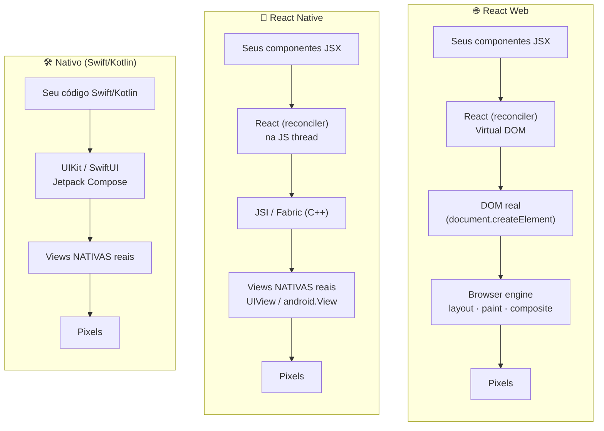
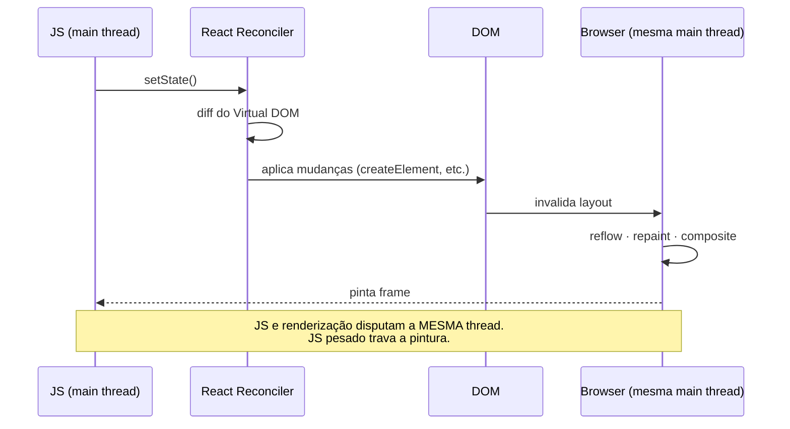
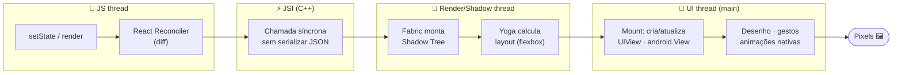
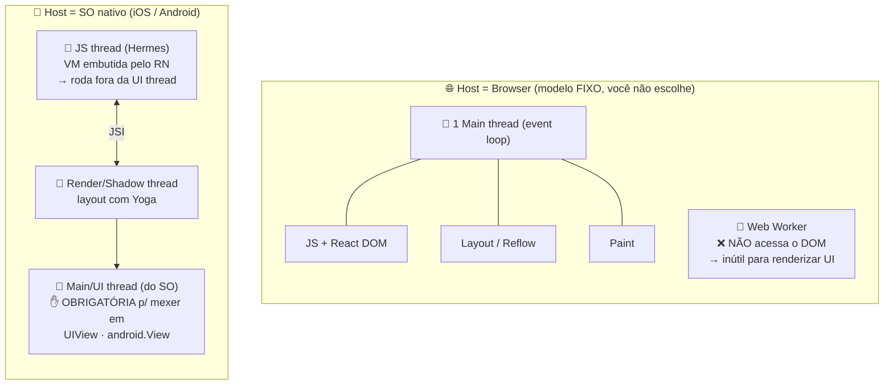
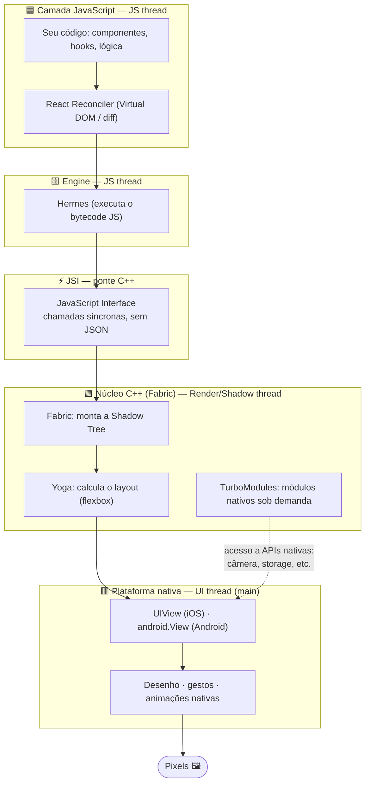
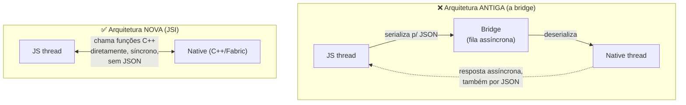
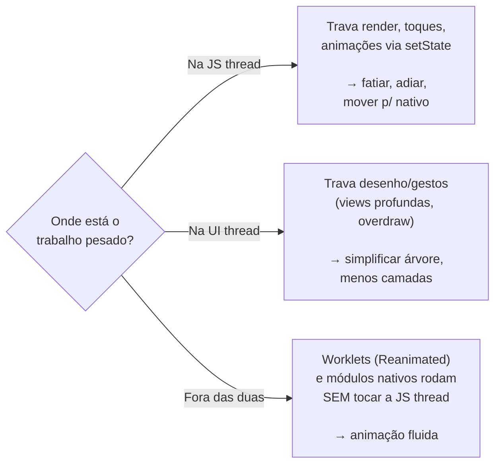
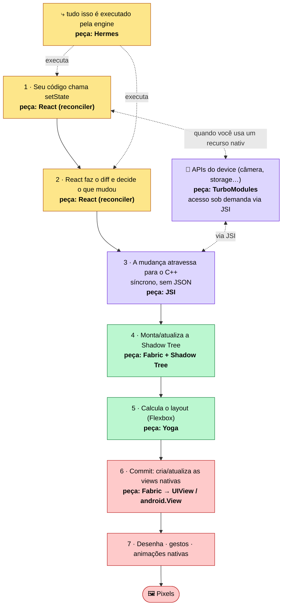

# Como o React Native funciona — comparado com React Web e Nativo

Documento de apoio ao estudo. O objetivo é responder: **"o que acontece entre o seu `<View>` e o pixel na tela?"** — e por que isso importa para performance.

> Os diagramas abaixo usam Mermaid (renderizam direto no VS Code e no GitHub).

---

## 1. Visão geral: três formas de desenhar na tela



**A diferença essencial:**
- **React Web** produz **DOM** (elementos HTML) que o browser desenha.
- **React Native** produz **views nativas de verdade** (`UIView` no iOS, `android.View` no Android) — não é WebView, não é HTML. O `<View>`/`<Text>` do RN viram componentes nativos.
- **Nativo** você mesmo cria as views, sem camada de JS no meio.

> Ou seja: RN usa o **mesmo "cérebro" do React** (o reconciler/Virtual DOM) que o React Web, mas troca o **"alvo de renderização"** de DOM para views nativas. É o conceito de *renderer* plugável do React (React DOM vs React Native).

---

## 2. React Web: tudo na main thread do browser



No browser, JavaScript e a renderização (layout/paint) compartilham a **main thread**. Por isso, no web, um `for` gigante também trava a UI — mesmo problema da nossa Demo 1, só que sem a separação de threads.

---

## 3. React Native (New Architecture): a separação em threads

Esta é a parte que mais importa para o estudo. O caminho de um `setState` até o pixel passa por **threads diferentes**:



**Mapeando para as nossas demos:**

| Etapa | Thread | Demo que estressa essa etapa |
| --- | --- | --- |
| Render / reconciliação | JS thread | **Demo 2** (re-renders desnecessários) |
| Trabalho síncrono no seu código | JS thread | **Demo 1** (loop bloqueando a JS) |
| Layout (Yoga) + montar a árvore | Render thread | **Demo 3** (montar 3000 itens de uma vez) |
| Desenho + animação na tela | UI thread | **Demo 4** (animação na UI thread segue suave) |

---

## 4. Por que o React Native tem MAIS threads que o React Web?

A resposta é contraintuitiva: **o número de threads não é uma decisão do React — é uma imposição da plataforma (o _host_) onde ele roda.** O React em si (o reconciler/Virtual DOM) é single-thread nos dois casos. O que muda é o ambiente ao redor.

### 4.1. A causa: o host é diferente



Duas restrições do mundo nativo **forçam** a separação:

1. **O SO exige que toda UI rode na main/UI thread.** No iOS e no Android, mexer em `UIView`/`android.View` só é permitido na thread principal. Essa thread já existe e é do sistema.
2. **JavaScript não roda nativamente em mobile** — o RN precisa *embutir* uma engine (Hermes). Essa VM roda naturalmente numa thread **separada** da UI thread do SO.

Só por existir nesse ambiente, o RN **já nasce com duas threads** (JS + UI). A partir daí veio a decisão de design: como já estão separadas, o RN colocou também o **layout (Yoga) numa render/shadow thread própria**, para não travar nem o JS nem a UI.

No browser é o oposto: **JS e renderização compartilham a mesma main thread** e você não pode mudar isso. Existe `Web Worker`, mas ele **não acessa o DOM**, então não serve para renderizar a UI. Por isso o React DOM é obrigado a viver numa thread só.

### 4.2. A arquitetura do React Native em camadas



**Lendo de cima para baixo:** seu código React roda no Hermes (JS thread) → atravessa o JSI → o Fabric monta a árvore e o Yoga calcula o layout (render thread) → as views nativas são criadas/atualizadas e desenhadas (UI thread). Os **TurboModules** são o caminho lateral para APIs nativas do device.

### 4.3. Em uma frase

```
Web:  1 plataforma single-thread para UI  →  React DOM cabe em 1 thread (sem escolha)
RN :  UI nativa OBRIGA a main thread  +  JS precisa de uma VM embutida (outra thread)
      →  já são 2, e o RN adiciona a de layout para desacoplar  →  3
```

No web, a separação seria **impossível** (o browser não deixa). No React Native ela é **inevitável** (o SO obriga) **e desejável** (mantém a UI fluida mesmo com o JS travado) — a base de todo o estudo de performance.

---

## 5. Por que a New Architecture é mais rápida: bridge antiga vs JSI



- **Bridge antiga:** toda comunicação JS↔nativo era **assíncrona** e exigia **serializar tudo em JSON**. Em listas grandes ou muitos eventos (scroll, gestos), essa fila virava gargalo — o famoso "evite passar pela bridge".
- **JSI (nova):** o JS guarda **referências diretas** a objetos C++/nativos e os chama **sincronamente, sem serialização**. A bridge deixou de ser o gargalo. Por isso muitos conselhos antigos mudaram.

---

## 6. Tabela comparativa

| Aspecto | React Web | React Native (New Arch) | Nativo (Swift/Kotlin) |
| --- | --- | --- | --- |
| O que é renderizado | DOM (HTML) | Views nativas reais | Views nativas reais |
| "Cérebro" (reconciler) | React DOM | React Native (Fabric) | — (você escreve direto) |
| Onde o JS roda | Main thread do browser | JS thread separada (Hermes) | Não há JS |
| Threads de UI | 1 (main) | JS + Render + UI (separadas) | UI thread nativa |
| Animações suaves sob carga | Difícil (mesma thread) | Sim, via UI thread (Reanimated) | Sim, nativo |
| Causa típica de jank | JS pesado na main thread | JS thread bloqueada / re-renders | Trabalho pesado na main thread |
| Ponte JS↔UI | N/A (mesmo runtime) | JSI (síncrono, sem JSON) | N/A |

---

## 7. A grande sacada para performance



A separação de threads do React Native é uma **faca de dois gumes**:
- **Vantagem:** dá pra manter animações/gestos fluidos na UI thread mesmo com a JS ocupada (impossível no web puro).
- **Custo:** comunicação entre threads tem um preço, e é fácil sobrecarregar a JS thread sem perceber.

**Profiling é justamente descobrir em qual dessas três caixas o seu problema está** — e as 4 demos deste projeto existem para você ver cada uma delas isoladamente.

---

## 8. Glossário da arquitetura — Hermes, JSI, Fabric, Yoga…

A ideia-guia: para desenhar na tela você precisa de 4 coisas — **(1)** executar o JS, **(2)** decidir o que mudou, **(3)** calcular onde cada coisa fica, **(4)** desenhar. No web o **browser** te dá quase tudo de graça. No RN **não há browser**, então o React Native teve que trazer cada peça por conta própria — por isso elas têm nome.

Cada peça abaixo segue o molde: **o que é → equivalente no React Web → equivalente no Nativo → por que existe.**

### 🟨 Hermes — a engine de JavaScript
- **O que é:** o motor que executa o seu JS no device. Compila o JS para **bytecode antecipadamente** (no build) e roda **sem JIT**, otimizado para iniciar rápido e usar pouca memória.
- **No React Web:** a engine do browser — **V8** (Chrome), **JavaScriptCore** (Safari), **SpiderMonkey** (Firefox). Vem embutida no browser.
- **No Nativo:** **não existe.** Swift/Kotlin compilam direto para código de máquina; não há JS.
- **Por que existe:** o celular não tem browser para emprestar a engine, então o RN precisa *embutir* uma. O Hermes foi feito pela Meta para o caso mobile: **startup rápido** (bytecode pronto), **memória baixa**, tamanho pequeno.

### ⚡ JSI — JavaScript Interface
- **O que é:** camada fina em **C++** que deixa o JS **segurar referências e chamar objetos/funções nativos diretamente, síncrono e sem serializar**. Substituiu a "bridge" antiga (JSON assíncrono). É agnóstica de engine.
- **No React Web:** os **bindings internos da engine** — o V8 expõe o DOM (C++) ao JS como _host objects_. Sempre existiu, mas é interno e invisível.
- **No Nativo:** **não se aplica** — o código já é nativo, não há fronteira a atravessar.
- **Por que existe:** a comunicação JS↔nativo era o maior gargalo da arquitetura antiga. O JSI dá ao JS o poder que o browser sempre teve: falar com o C++/nativo **direto, na hora, sem traduzir para texto**.

### 🟩 Fabric — o renderer
- **O que é:** o sistema de renderização do RN, reescrito em **C++**. Transforma a árvore React em **views nativas**, gerenciando a Shadow Tree e o _commit_ na tela.
- **No React Web:** o **React DOM** — o renderer que transforma `<div>` em nós do DOM. Fabric é "o React DOM do mundo nativo".
- **No Nativo:** **você mesmo** escrevendo UIKit/SwiftUI ou o View system/Jetpack Compose.
- **Por que existe:** o renderer antigo (*Paper*) era dirigido pelo JS, assíncrono, sem medição síncrona de layout nem suporte a React concorrente. Fabric (C++, compartilhado entre plataformas) permite **medição síncrona**, **render concorrente** e melhor integração com a UI thread.

### 🌳 Shadow Tree — a árvore intermediária
- **O que é:** árvore **imutável de _shadow nodes_** (C++, na render thread) que espelha sua árvore React e guarda o layout já calculado. Fica entre "seus componentes" e "as views nativas".
- **No React Web:** a **render/layout tree** que o browser monta do DOM + CSSOM.
- **No Nativo:** sem equivalente explícito — a hierarquia de views *é* a árvore.
- **Por que existe:** permite **calcular layout fora da main thread** e **fazer diff** antes de tocar nas views nativas (que são caras de criar/alterar).

### 📐 Yoga — o motor de layout
- **O que é:** biblioteca em **C++** que implementa **Flexbox**. Pega seus estilos (`flex`, `margin`, `justifyContent`…) e calcula posição e tamanho de cada elemento.
- **No React Web:** o **motor de layout do browser** (Blink/WebKit/Gecko), que calcula o CSS (Flexbox, Grid, etc.). De graça.
- **No Nativo:** **Auto Layout** (iOS) e **ConstraintLayout** (Android) — diferentes entre si e não-Flexbox.
- **Por que existe:** o RN precisa que `flexDirection: 'row'` se comporte **igual** em iOS, Android e web. Como nenhuma plataforma usa Flexbox nativamente, a Meta embarcou seu **próprio motor de Flexbox** para layout consistente em todo lugar.

### 🔌 TurboModules — acesso às APIs nativas
- **O que é:** o sistema novo de **módulos nativos** (câmera, storage, GPS, haptics…). Carregados **sob demanda** (lazy), com acesso **síncrono e tipado** via JSI.
- **No React Web:** as **Web APIs** do browser (`navigator.geolocation`, `fetch`, `localStorage`…) — também pontes para o C++ do browser.
- **No Nativo:** **chamar o SDK direto** (ex.: `AVFoundation`, `CameraX`).
- **Por que existe:** os antigos `NativeModules` eram carregados **todos no startup** e passavam pela bridge assíncrona. TurboModules são **lazy** (startup mais rápido) e **síncronos** via JSI.

### 🧩 Codegen — o "contrato" tipado
- **O que é:** ferramenta que **gera o código de cola** (C++/Java/ObjC) entre JS e nativo a partir de specs em TypeScript/Flow, para TurboModules e componentes Fabric.
- **No web / nativo:** sem equivalente.
- **Por que existe:** garante que JS e nativo concordem sobre os tipos **em tempo de build**, evitando erros na fronteira do JSI.

---

### O fluxo completo: onde cada peça entra

Juntando tudo — o caminho de um `setState` até o pixel, com **cada peça nomeada** no ponto em que atua e em qual thread:



> 🟨 amarelo = **JS thread** (Hermes) · 🟪 roxo = **fronteira JSI (C++)** · 🟩 verde = **Render/Shadow thread** (Fabric + Yoga) · 🟥 vermelho = **UI thread** (views nativas).

**Passo a passo, com a peça responsável:**

| # | Etapa | Peça | Thread |
| --- | --- | --- | --- |
| 1–2 | Você muda o estado; o React calcula o _diff_ | **React reconciler**, rodando no **Hermes** | JS thread |
| 3 | A mudança cruza para o lado nativo, síncrona e sem serializar | **JSI** | fronteira (C++) |
| 4 | A nova árvore de nós é montada | **Fabric** + **Shadow Tree** | Render thread |
| 5 | As posições/tamanhos são calculados (Flexbox) | **Yoga** | Render thread |
| 6 | As views nativas reais são criadas/atualizadas (_commit_) | **Fabric** → `UIView`/`android.View` | UI thread |
| 7 | A tela é desenhada; gestos e animações nativas rodam | plataforma nativa | UI thread |
| — | Quando precisa de um recurso do device | **TurboModules** (sob demanda, via **JSI**) | JS ↔ nativo |
| build | Gera a cola tipada entre JS e nativo (não roda em runtime) | **Codegen** | em tempo de build |

> **Conexão com profiling:** cada cor é uma thread diferente. Quando o app trava, a pergunta é *"em qual cor está o gargalo?"* — JS pesado (amarelo, Demos 1 e 2), layout/montagem de muita coisa (verde, Demo 3) ou desenho/animação (vermelho, Demo 4). O **Codegen** não aparece no runtime porque seu trabalho acontece no build.

---

### A grande sacada: o browser já fazia tudo isso

Cada peça da New Architecture é algo que o **browser já te dava embutido**, e que o RN teve que recriar porque no celular não há browser:

| Função | React Web (de graça, no browser) | React Native (peça própria) | Nativo |
| --- | --- | --- | --- |
| Executar JS | V8 / JavaScriptCore | **Hermes** | — (não há JS) |
| JS falar com a UI (C++) | bindings internos da engine | **JSI** | — (já é nativo) |
| Transformar React em UI | React DOM | **Fabric** | você escreve UIKit/Compose |
| Árvore intermediária | render/layout tree do browser | **Shadow Tree** | a própria hierarquia de views |
| Calcular layout | motor de CSS do browser | **Yoga** (Flexbox) | Auto Layout / ConstraintLayout |
| Acessar recursos do device | Web APIs (`navigator`, etc.) | **TurboModules** | SDK nativo direto |
| O "cérebro" (diff) | React (reconciler) | React (reconciler) — **o mesmo** | — |

> **Conclusão:** o React Web "terceiriza" 90% do trabalho pesado para o browser. O React Native, sem browser, teve que **reimplementar o browser inteiro em miniatura** (Hermes = engine, Yoga = CSS layout, Fabric = renderer, JSI = bindings, TurboModules = Web APIs). Entender cada peça dá o modelo mental completo de onde a performance pode quebrar.